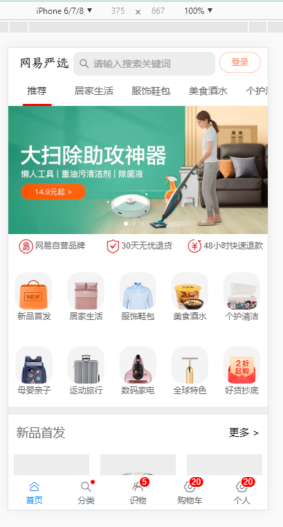
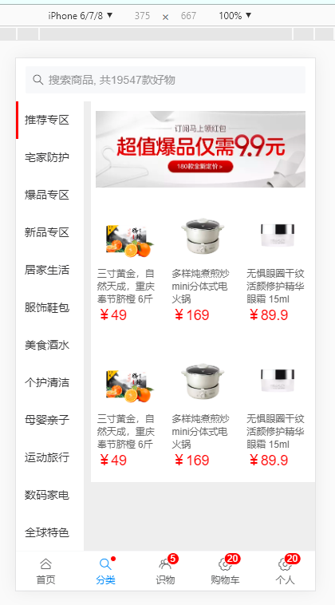

# 一、vue-vant-shop 使用

## 安装
```
npm install
```

### 开发热启动
```
npm run serve
```

### 发布
```
npm run build
```


# 二、本项目部分截图（仿网易严选）

​		




# 三、以下为本项目创建过程

## 1.初始化项目

* 安装基础组件

```
npm create vue-vant-show
cd vue-vant-shop
npm run serve

# 安装vant
npm i vant -S

npm i vue-router -S

```

* 引入

  * 安装babel

    ```
    #安装插件
    npm i babel-plugin-import -D
    #安装jsx插件
    npm install babel-plugin-transform-vue-jsx --save-dev
    npm install babel-plugin-transform-runtime --save-dev
    npm install babel-plugin-syntax-jsx --save-dev
    ```

    

  * babel.config.js 
    * 作用：es6不是所有浏览器都支持，babel将es6转换成浏览器能识别的代码，此文件设置转码规则和插件

    ```
    "plugins": [
        // 以下babel6引入方法
        // "transform-vue-jsx",//处理全局函数、优化babel插件
        // "transform-runtime",//编译jsx
        // ["import", {
        //   "libraryName": "vant",
        //   "libraryDirectory": "es",//es6模块项目，import 来引用模块，打包体积更小
        //   "style": true
        // }]
        //以下babel7引入方法
        "@babel/plugin-transform-runtime",
        "@babel/plugin-syntax-dynamic-import",
        "@babel/plugin-proposal-object-rest-spread",
        "transform-vue-jsx",
        ['import', {
          libraryName: 'vant',
          libraryDirectory: 'es',
          style: true
        }, 'vant']
      ]
    ```

    

  

  

## 2. 移动端适配

* 

  * ```html
    <meta charset="utf-8">
    <meta name="viewport" content="initial-scale=1, maximum-scale=1, minimum-scale=1, user-scalable=no,width=device-width, viewport-fit=cover">
    ```

* rem

  * `rem`是相对于根元素，我们只需要在根元素确定一个参考值，这个参考值设置为多少，完全可以根据您自己的需求来定。http://caibaojian.com/rem-and-px.html

    ```
    <html style="font-size:16px;">
    ```

    * nodejs 导入：先按js文件，如果没js没有解析其它文件类型

## 3. nodejs中间件

* 作用：模拟服务端接口

* express 安装

  ```
  npm install express -save-dev
  ```

* axios安装

  ```
   npm install axios -save-dev
  ```

